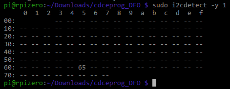

# How to program CDCE913/925 chip for DFOs
This guide is for programming the Texas Instruments CDCE913/925 PLL chip used DFOs for the Mega Drive, Playstation and Saturn with a Raspberry Pi. This corrects the sync frequency with a DFO (Dual Frequency Oscillator) to match 60Hz on PAL consoles when using region modded PAL/NTSC consoles. This is my collection of files to make the process much easier to do. 

Credit goes to [ikorb](https://github.com/ikorb/cdceprog). Original thread [here](https://nfggames.com/forum2/index.php?topic=5744.0).

## Connections

To connect the DFO to the Raspberry Pi, check the nice overview of the
GPIO connector [here](http://pi.gadgetoid.com/pinout). The programming
pins on the DFO must be connected as follows:

* DFO `SDA` to RasPi pin 3
* DFO `SCL` to RasPi pin 5
* DFO `GND` to RasPi pin 6
* DFO `3.3V` or `5V` to RasPi pin 1 or 2 (depends on the DFO board).

When the connection is done, open up your SSH software of choice, connect to the Rpi and check if you can communicate with the clock generator chip on the DFO using:

`sudo i2cdetect -y 1`

You should see a lot of dashes but in all those dashes there should be a number saying 65 (or any number) like this:

.

If so, your good to go. If not, check your connections.

## Programming

Let's start by downloading the Python script (this does the programming) and the HEX-files for Mega Drive, Playstation or Saturn (timing files).

Type the following:

       cd Downloads
       git clone https://github.com/fix-ON/cdceprog_DFO.git
       cd cdceprog_DFO

       
Now, if your programming a DFO for the Mega Drive or Playstation, use `MD_PSX.HEX`. The Saturn, use `SAT.HEX`.

In this guide we're using the `MD_PSX.HEX`, so type:

       sudo python cdceprog.py MD_PSX.HEX 
       
You should see a text that says: 

       Found data for a CDCE 913 chip.
       Waiting until EEPROM write cycle finishes...
       
Congratulations!

Your DFO is now programmed.

## Installation

Connect the DFO pins to the corresponding points on your specific motherboard version.

- [Installation guide for Playstation](https://www.consolesunleashed.com/guides/sony-playstation-dual-frequency-oscillator-install-guide/)
- [Installation guide for Mega Drive](https://www.consolesunleashed.com/guides/sony-playstation-dual-frequency-oscillator-install-guide/)

Playstation Playstation SCPH-100X PU-8:
  

Example of installed DFO in a Playstation.

